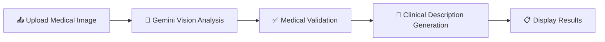

<h1 align="center">
🏥 AI Medical Image Recognition & Clinical Description Generator
</h1>

-- Developed an AI-powered web application that analyzes uploaded medical images using Google Gemini Vision and generates clinically relevant medical descriptions. Implemented automated medical image validation, secure API integration using environment variables, improved error handling, optimized application stability through bug fixes and code refactoring, and delivered a responsive Flask-based user interface.

## Why This?
Medical image interpretation requires expertise and time.
This application demonstrates how Google Gemini Vision can assist by analyzing uploaded medical images, validating medical relevance, and generating AI-powered clinical descriptions through a simple Flask web interface.

# ✨ Key Features
- 🤖 Google Gemini Vision integration
- 🩺 AI-powered medical image analysis
- 📋 Clinical description generation
- ✅ Intelligent medical image validation
- ⚡ Fast real-time inference
- 🔒 Secure API integration
- 🌐 Flask-based backend
- 🎨 Responsive user interface
- 🛠 Optimized & refactored codebase
- 📈 Scalable project architecture

## ⚙️ Technologies & Tools Used
| Technology | Purpose |
|------------|---------|
| 🐍 **Python** | Main programming language used to build the application. |
| 🌐 **Flask** | Web framework for handling the backend and routing. |
| 🤖 **Google Gemini Vision** | Analyzes uploaded medical images. |
| 🧠 **Google Gemini Pro** | Validates medical images and generates clinical descriptions. |
| 🔗 **Google Generative AI API** | Connects the application to Google's Gemini AI models. |
| 🖼 **Pillow (PIL)** | Processes uploaded images before AI analysis. |
| 🔐 **python-dotenv** | Loads API keys securely from environment variables. |
| 🎨 **HTML5 & CSS3** | Builds the user interface. |
| 📦 **pip** | Installs and manages project dependencies. |
| 📝 **Git & GitHub** | Version control and project hosting. |
| 💻 **VS Code** | IDE used for development and debugging. |


## 🔄 Workflow


## 📂 Project Structure
```text
AI-Medical-Image-Recognition/
│
├── 📂 static/
│   └── 🎨 style.css            # Application styling
│
├── 📂 templates/
│   └── 📄 index.html           # Main user interface
│
├── 🐍 app.py                   # Flask application entry point
├── 🐍 next.py                  # AI processing & response generation
├── 📦 requirements.txt         # Project dependencies
├── 🔒 .env                     # Environment variables (not tracked)
├── 🚫 .gitignore               # Git ignore rules
└── 📘 README.md                # Project documentation
```

## 🚀 Installation
### 1. Clone the Repository
```bash
git clone https://github.com/your-username/AI-Medical-Image-Recognition.git
cd AI-Medical-Image-Recognition
```
### 2. Install Dependencies
```bash
pip install -r requirements.txt
```
### 3. Configure Environment Variables
Create a `.env` file and add your Google Gemini API key:
```env
GOOGLE_API_KEY=your_api_key_here
```
### 4. Run the Application
```bash
python app.py
```
   
## 🚀 Project Enhancements
- 🛠 Fixed runtime issues
- ⚡ Optimized codebase
- ✅ Improved validation
- 🔒 Strengthened API security
- 🎨 Enhanced UI/UX
- 📚 Updated documentation

## 🚀 Future Enhancements
- 🩺 Disease classification
- 📄 PDF report export
- 📝 Prescription OCR
- 🌍 Multi-language support
- 📊 Confidence scoring
- ☁️ Cloud deployment
- 📱 Mobile-friendly interface

# API Key Setup

To use this project, you need an API key from Google Gemini Large Language Model.

# Contact Details

Vempala Sai Gautam - [saigautam315@gmail.com](saigautam315@gmail.com)

