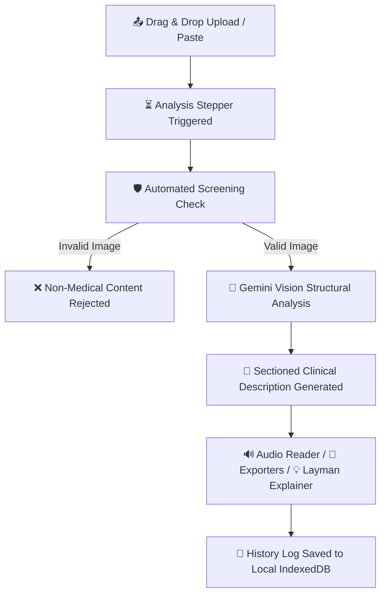

# 🏥 AI Medical Vision - Image Recognition & Clinical Description Generator

An advanced, production-ready AI healthcare Single Page Application (SPA) designed to analyze medical images, validate clinical relevance using Google Gemini Vision, and generate detailed observations, findings, and recommendations.

---

## 🚀 Key Features

*   **Premium SaaS UI**: Sleek, responsive, and futuristic interface with smooth dark/light mode toggling, custom glassmorphic cards, and fade animations.
*   **Intelligent Screening**: Automated medical validation filters non-medical images to ensure diagnostic reliability.
*   **Multi-Step Analysis Stepper**: Beautiful loading pipeline showing checklist steps: *Uploading ➜ Analyzing ➜ Validating ➜ Generating ➜ Completed*.
*   **Structured observations**: Interactive sections dividing results into Observations, Possible Findings, Recommendations, and a Clinical Disclaimer.
*   **Medical Jargon Simplifier**: Explains complex medical jargon in clear, patient-friendly layman terms.
*   **Speech Synthesis Reader**: Reads observations and reports aloud using native browser Web Speech API.
*   **Multi-Format Exporter**: Download clinical reports in custom print-ready PDF, Markdown (MD), or raw text (TXT) formats.
*   **Local History & compliance**: Fully HIPAA & GDPR compliant local-first design storing report logs in `localStorage` and image files locally in browser `IndexedDB`.
*   **Interactive Analytics**: Recharts dashboards showing total scans, validation integrity ratios, processing times, and diagnostic categories.
*   **Settings Diagnostics**: Live connection check monitoring Flask server status, Google Gemini API status, and active model names.

---

## ⚙️ Technologies & Tools

### Frontend (React SPA)
*   **React.js (v19)**: Core UI framework.
*   **Vite**: Next-generation bundler and dev server.
*   **Tailwind CSS (v4)**: Custom theme color palettes, HSL styling, and animations.
*   **Framer Motion**: Page transitions and stepper animations.
*   **Recharts**: Area, bar, and pie charts.
*   **IndexedDB**: Local browser storage for medical scans.
*   **Axios**: REST API communication handler.
*   **Lucide Icons**: Premium vector icons.

### Backend (Flask REST API)
*   **Flask (Python)**: Exposes endpoints (`/api/analyze` and `/api/status`) and serves SPA static bundles in production.
*   **Flask-CORS**: Enables cross-origin request routing during development.
*   **Google GenAI SDK**: Integrates the `gemini-3.1-flash-lite` AI engine.
*   **Pillow**: Image processing and thumbnail resizing.

---

## 🔄 Workflow



---

## 📂 Project Structure

```text
Modified Medicine-Recognition-System/
│
├── 📂 dist/                      # Compiled React build served by Flask in prod
├── 📂 public/                    # Static favicon and SVG files
├── 📂 src/
│   ├── 📂 components/            # UI components (Navbar, Loader, Dropzone, AnalysisResult)
│   ├── 📂 context/               # State managers (ThemeContext, HistoryContext)
│   ├── 📂 pages/                 # Routing pages (Landing, Dashboard, History, Analytics, Settings, Profile)
│   ├── 📂 services/              # Axios API service endpoints
│   ├── 📂 utils/                 # Utilities (db local caching, speech TTS, pdfExporter)
│   ├── 📄 App.jsx                # Main router entry point
│   └── 📄 index.css              # Global styles & Tailwind v4 theme configurations
│
├── 📄 app.py                     # Flask backend entry point and static server
├── 📄 vite.config.js             # Vite configuration with Flask dev proxy
├── 📄 postcss.config.js          # Tailwind build configuration
├── 📄 tailwind.config.js         # Tailwind configuration content hooks
├── 📄 requirements.txt           # Python backend dependencies
└── 📄 .env                       # Local API key configurations (hidden)
```

---

## 🚀 Installation & Running Local Servers

### 1. Clone the Repository
```bash
git clone https://github.com/saigautam3/AI-Medical-Image-Recognition.git
cd AI-Medical-Image-Recognition
```

### 2. Install Project Dependencies
```bash
# Python backend dependencies
pip install -r requirements.txt

# Node frontend dependencies
npm install
```

### 3. Configure API Key
Create a `.env` file in the root directory:
```env
GOOGLE_API_KEY=your_gemini_api_key_here
```

### 4. Run Development Servers
Start the Flask backend (Port `5000`):
```bash
python app.py
```
Start the React dev server (Port `5173`):
```bash
npm run dev
```
Open **[http://localhost:5173](http://localhost:5173)** in your browser.

---

## 👤 Developer
**Vempala Sai Gautam** - [saigautam315@gmail.com](mailto:saigautam315@gmail.com)